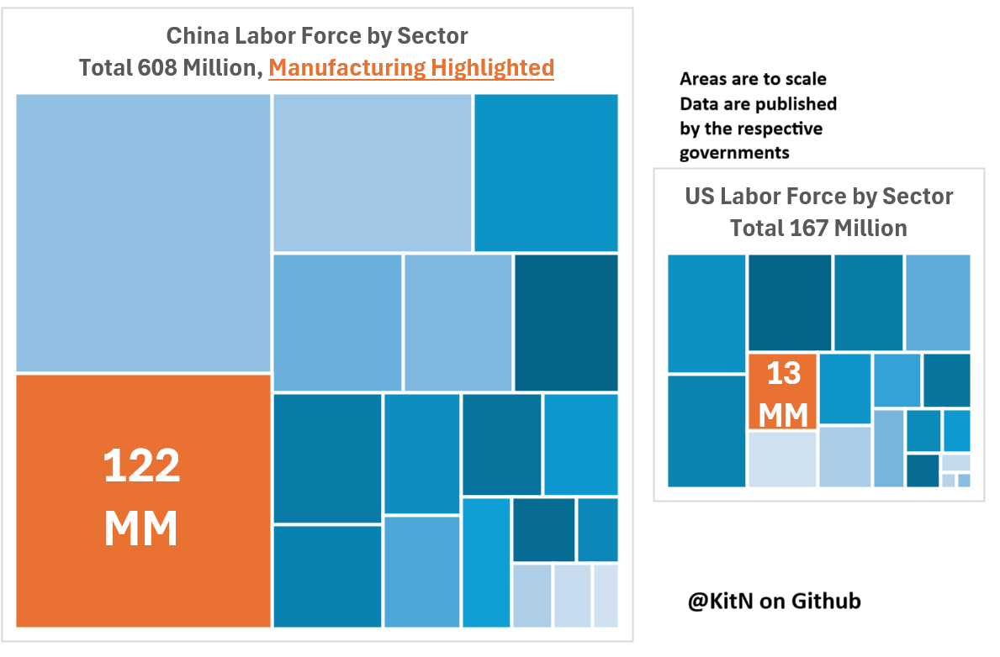

# 30 Days of Charts
I started a bit late to this challenge because I only discovered it halfway in. I'm having fun seeing what everyone comes up with.

## Day 14 - Kinship
I looked at the taxonomic relationships of the most common plants in the North American diet, including staples, fruits, veg and spices. I followed many dead-ends from my initial idea before arriving at this chart. Three quarters of my time went into exploring datasets and learning tools that I ultimately abandoned, but you'd never know that from looking at the finished project. 

### Reflections
I followed many dead-ends from my initial idea before arriving at this chart. Three quarters of my time went into exploring datasets and learning tools that I ultimately abandoned, but you'd never know that from looking at the finished project. I wonder how other participants will manage their time and scope; one chart a day, if they all take this long, is not feasible.

## Day 15 - Complex
The US and Chinese economies are linked through millions of products, firms, and people. I wanted to cut through that complexity and show one crucial data point in context. Though they measure and categorize differently, both countries list the number of workers employed in 'manufacturing'. 

### Reflections
I combed through Chinese websites and Chinese documents for a long time before finding the data I needed on an English page. I wish I had known that from the start, but I realize that the process unfolded organically and that things are always obvious in hindsight -- if given a second chance, many of us would change the mistakes of our youth, yet we would be different people without those mistakes.
